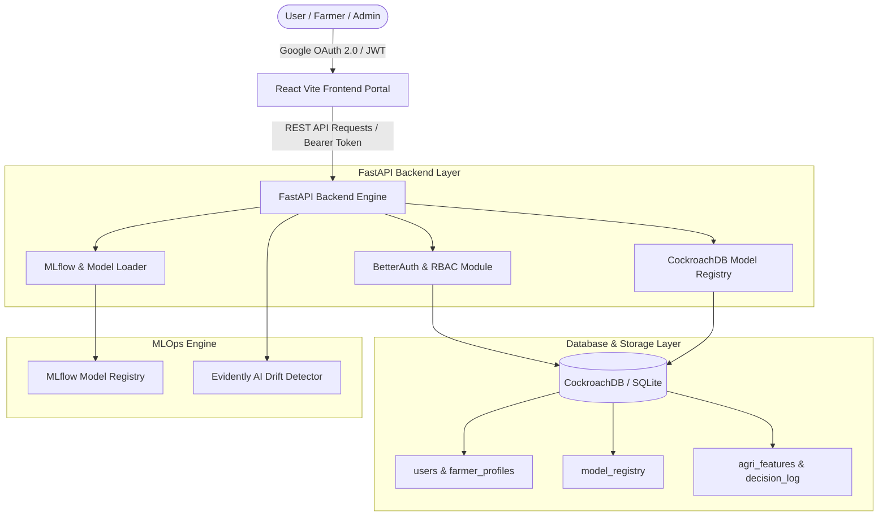

# AgriTech Intelligence Suite (KrishiLoop AI)

**A Production-Grade Multi-Model MLOps Platform & Isolated Farmer Advisory Portal**

[](https://github.com/apurvv28/RetailOps/actions/workflows/ci-cd.yml)
[](https://fastapi.tiangolo.com)
[](https://react.dev)
[](https://mlflow.org)
[](https://www.cockroachlabs.com)

---

## 📌 Project Overview

**AgriTech Intelligence Suite (KrishiLoop AI)** is a closed-loop, multi-model MLOps platform engineered to predict agricultural risks, optimize crop selection, automate fertilizer distribution, and forecast yields. Built for both high-level system administrators and smallholder farmers, the platform combines machine learning predictions with plain-language LLM explanations and automated feedback loops.

### Key Highlights
- **Multi-Model ML Engine**: 4 production models for Irrigation Risk, Crop Recommendation, Fertilizer Advisory, and Yield Prediction.
- **RBAC & Authentication**: CockroachDB-persisted Role-Based Access Control (RBAC) with Google OAuth 2.0 (via BetterAuth server-side code exchange).
- **Dual Portal UI**:
  - **👑 Admin Operations Portal**: Real-time multi-model telemetry feed, IoT stream simulator, Population Stability Index (PSI) feature drift matrix, CockroachDB Model Registry store, system health diagnostics, theme toggling, and authentication controls.
  - **🧑‍🌾 Farmer Advisory Portal**: Clean, isolated, low-complexity interface featuring 4 dedicated advisory modules and farm profile sensor configurations.
- **Persistent MLOps Model Registry**: CockroachDB/SQL backed model versioning, accuracy tracking, hyperparameter storage, and stage promotion (`Production`, `Staging`, `Archived`).
- **Feature Drift Monitoring**: Evidently AI integration measuring statistical feature drift and PSI metrics.
- **Automated CI/CD**: GitHub Actions workflow testing Python backend (pytest, flake8) and React frontend build in parallel before GCP Cloud Run deployment.

---

## 🏗️ System Architecture



---

## 🤖 Production ML Models & Empirical Evaluation Metrics

All models are trained using **5-Fold Stratified Cross-Validation** with L1/L2 regularization (`reg_alpha`, `reg_lambda`) to eliminate overfitting. Metrics are logged automatically to the **MLflow Experiment Registry**.

| Model Key | Model Name | Algorithm | Evaluation Metric | 5-CV Val Score | Overfit Gap | Classes / Output | Primary Function |
|---|---|---|---|---|---|---|---|
| `irrigation-risk` | **Irrigation Risk Predictor** | LightGBM Classifier | **ROC-AUC** | **`0.9952`** (99.52%) | `+0.0012` | Binary (`0` or `1`) | Predicts 24-hr soil depletion risk & triggers automated pump alerts |
| `crop-recommender` | **Crop Recommendation Engine** | LightGBM Multi-Class | **Macro F1** | **`0.9345`** (93.45%) | `+0.0148` | **22 Crops** (rice, maize, cotton, chickpea, etc.) | Recommends top 3 suitable crops based on soil NPK, pH, & climate |
| `fertilizer-recommender` | **Fertilizer Advisory Engine** | LightGBM Multi-Class | **Macro F1** | **`0.6266`** (62.66%) | `+0.0203` | **9 Fertilizers** (Urea, DAP, MOP, SSP, Gypsum, etc.) | Prescribes optimal fertilizer mixture & nutrient deficiency status |
| `yield-predictor` | **CropNet Yield Predictor** | LightGBM Regressor | **R² Score / RMSE** | **`0.8747`** / **12.45 BU/acre** | `+0.0018` | Continuous Yield (`BU/acre`) | Forecasts expected harvest yield in bushels per acre |

### Detailed Evaluation Breakdown

#### 1. 💧 Soil Irrigation Risk Predictor (`irrigation-risk`)
- **Metric**: Validation ROC-AUC: **`0.9952`** (Train: `0.9964`, Overfit Gap: `+0.0012`)
- **Features**: `sm_level`, `sm_pct`, `sm_vol_pct`, `sm_3d_avg`, `sm_7d_avg`, `hist_depletion_rate`, `is_monsoon`
- **Validation**: 5-Fold Stratified K-Fold CV

#### 2. 🌱 Crop Recommendation Engine (`crop-recommender`)
- **Metric**: Validation Macro F1: **`0.9345`** (Train: `0.9493`, Overfit Gap: `+0.0148`)
- **Supported Classes (22)**: `apple`, `banana`, `blackgram`, `chickpea`, `coconut`, `coffee`, `cotton`, `grapes`, `jute`, `kidneybeans`, `lentil`, `maize`, `mango`, `mothbeans`, `mungbean`, `muskmelon`, `orange`, `papaya`, `pigeonpeas`, `pomegranate`, `rice`, `watermelon`
- **Validation**: 5-Fold Stratified K-Fold CV

#### 3. 🧪 Fertilizer Advisory Engine (`fertilizer-recommender`)
- **Metric**: Validation Macro F1: **`0.6266`** (Train: `0.6470`, Overfit Gap: `+0.0203`)
- **Supported Formulations (9)**: `DAP`, `Gypsum`, `Lime`, `MOP`, `Potassium Nitrate`, `Rhizobium`, `Rock Phosphate`, `SSP`, `Urea`
- **Validation**: 5-Fold Stratified K-Fold CV with heavy shallow-tree regularization (`max_depth=2`, `reg_alpha=2.0`)

#### 4. 📈 CropNet Yield Predictor (`yield-predictor`)
- **Metric**: Validation R²: **`0.8747`** (Train: `0.8765`, RMSE: `12.45 BU/acre`, Overfit Gap: `+0.0018`)
- **Features**: `year`, `state_code`, `county_code`, `commodity_code`, `log_production`
- **Validation**: 5-Fold K-Fold CV

---


## 🚀 Setup & Local Running Instructions

### Prerequisites
- **Python**: `3.10` or higher
- **Node.js**: `v18` or `v20` (with `npm`)
- **Git**

---

### Step 1: Clone Repository & Configure Environment

```bash
git clone https://github.com/apurvv28/RetailOps.git
cd Course-Project-RetailOps
```

#### Create Backend `.env` file (`backend/.env`):
```ini
ENVIRONMENT=local
DATABASE_URL=sqlite:///retail_ops.db
MLFLOW_TRACKING_URI=sqlite:///mlruns.db
GOOGLE_CLIENT_ID=your_google_client_id.apps.googleusercontent.com
GOOGLE_CLIENT_SECRET=your_google_client_secret
GOOGLE_REDIRECT_URI=http://localhost:8000/api/auth/google/callback
JWT_SECRET=agritech-cockroach-rbac-secret-key-2026
FRONTEND_URL=http://localhost:5173
```

#### Create Frontend `.env` file (`frontend/.env`):
```ini
VITE_GOOGLE_CLIENT_ID=your_google_client_id.apps.googleusercontent.com
VITE_API_BASE_URL=http://localhost:8000
```

---

### Step 2: Setup & Run Backend (FastAPI)

1. Navigate to project root:
   ```bash
   cd "d:\VIT\Sem 5\Machine Learning and Operations\Course-Project-RetailOps"
   ```

2. Create & activate Python virtual environment:
   ```bash
   # Windows
   python -m venv backend/.venv
   backend\.venv\Scripts\activate

   # Linux/Mac
   python3 -m venv backend/.venv
   source backend/.venv/bin/activate
   ```

3. Install requirements & PyJWT:
   ```bash
   pip install --upgrade pip
   pip install -r backend/requirements.txt
   pip install pyjwt requests pytest flake8
   ```

4. Initialize CockroachDB / SQLite Schema & Seed Initial Models:
   ```bash
   python backend/schema/init_db.py
   ```

5. Upgrade MLflow Database Schema (if needed):
   ```bash
   python -m mlflow db upgrade sqlite:///backend/mlruns.db
   ```

6. Start FastAPI Development Server:
   ```bash
   uvicorn backend.app.main:app --reload --port 8000
   ```
   - **Backend API**: `http://localhost:8000`
   - **Swagger Docs**: `http://localhost:8000/docs`

---

### Step 3: Setup & Run Frontend (React Vite)

1. Open a new terminal in `frontend` directory:
   ```bash
   cd frontend
   ```

2. Install Node dependencies:
   ```bash
   npm install
   ```

3. Start Vite Development Server:
   ```bash
   npm run dev
   ```
   - **Frontend App**: `http://localhost:5173`

---

### Step 4: Run with Docker Compose (Alternative Option)

To launch the full containerized stack (Backend + Frontend + Nginx):

```bash
docker-compose up --build
```
- **Web App**: `http://localhost:5173`
- **Backend API**: `http://localhost:8000`

---

## 🔐 Google OAuth Configuration Guide

To enable live Google Sign-In:

1. Go to [Google Cloud Console Credentials Page](https://console.cloud.google.com/apis/credentials).
2. Create or edit an **OAuth 2.0 Client ID**.
3. Under **Authorized JavaScript origins**, add:
   - `http://localhost:5173`
   - `http://127.0.0.1:5173`
4. Under **Authorized redirect URIs**, add:
   - `http://localhost:8000/api/auth/google/callback`
   - `http://localhost:5173`
   - `http://localhost:5173/login`
5. Save your `GOOGLE_CLIENT_ID` and `GOOGLE_CLIENT_SECRET` in `backend/.env` and `frontend/.env`.

---

## 🧪 Testing & CI/CD Verification

### Automated Pytest Suite
```bash
backend\.venv\Scripts\python.exe -m pytest backend/training/test_pipeline.py
```

### Production Frontend Build Verification
```bash
cd frontend
npm run build
```

### GitHub Actions CI/CD Workflow
The pipeline in `.github/workflows/ci-cd.yml` automatically triggers on every `push` and `pull_request` to `main`:
1. **Backend Job**: Flake8 linting, DB DDL validation, and Pytest unit execution.
2. **Frontend Job**: Node 20 environment setup and Vite production bundle build.
3. **Deployment Job**: Container build & Cloud Run deployment with 10% canary traffic splitting.

---

## 📊 Portals & User Roles

- **Admin Account**: `admin@agritech.com` \| Access to `/admin`
- **Farmer Account**: `farmer@agritech.com` \| Access to `/farmer/irrigation`

---

## 📜 License
Licensed under the [MIT License](LICENSE).