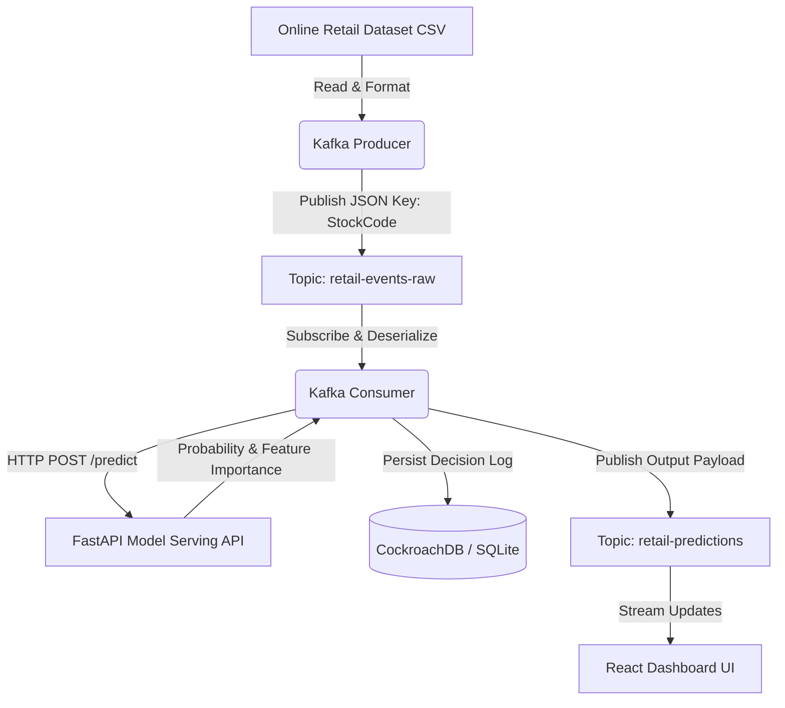

# Retail Ops Intelligence — Phase 5: Real-Time Streaming Layer

A high-throughput, event-driven streaming pipeline powered by Apache Kafka, connecting continuous retail transaction streams with the model serving API and persisting operational decision telemetry to CockroachDB / PostgreSQL.

---

## 🏗 Architecture Overview



### Components

1. **Kafka Producer (`producer.py`)**: Continuously streams formatted transactional events from the dataset into `retail-events-raw`, partitioned by SKU (`StockCode`) to ensure strictly ordered event processing per product.
2. **Kafka Consumer (`consumer.py`)**: Subscribes to `retail-events-raw`, constructs feature vectors, invokes the FastAPI `/predict` endpoint, writes the returned decision to CockroachDB (`decision_log` table), and forwards prediction output to `retail-predictions`.
3. **Kafka UI (`http://localhost:8085`)**: Visual management tool for inspecting topics, partitions, consumer groups, and message payloads.

---

## 🚀 Quick Start Guide

### 1. Prerequisites

- Python 3.10+ or Python 3.12
- Docker Desktop with Docker Compose
- Running FastAPI Model Serving Backend (`http://localhost:8080`)

### 2. Environment Setup

Copy `.env.example` to `.env` inside the `streaming/` directory:

```bash
cd streaming
cp .env.example .env
```

Install Python dependencies:

```bash
pip install -r requirements.txt
```

---

## 🐳 Running Kafka Infrastructure via Docker Compose

Spin up Zookeeper, Kafka broker, and Kafka UI in background mode:

```bash
docker-compose up -d
```

Verify service health:

```bash
docker-compose ps
```

Access **Kafka UI** in your browser at: [http://localhost:8085](http://localhost:8085)

To stop services and preserve state:

```bash
docker-compose stop
```

---

## 📡 Topic Creation

Topics are auto-created when messages are published. If manual creation is preferred:

```bash
# Create raw events topic (3 partitions)
docker exec -it retail-ops-kafka kafka-topics --bootstrap-server localhost:9092 --create --topic retail-events-raw --partitions 3 --replication-factor 1

# Create predictions topic (3 partitions)
docker exec -it retail-ops-kafka kafka-topics --bootstrap-server localhost:9092 --create --topic retail-predictions --partitions 3 --replication-factor 1
```

---

## 🏃 Running Producer and Consumer

### Step 1: Start the Consumer

In your first terminal window, start the Kafka Consumer:

```bash
python consumer.py
```

*The consumer connects to Kafka, subscribes to `retail-events-raw`, and waits for incoming events.*

### Step 2: Start the Producer

In a second terminal window, start the Event Producer:

```bash
python producer.py
```

*The producer reads the dataset and streams transactions into Kafka with configurable delays.*

---

## ⚙️ Environment Variables Reference

| Variable | Default Value | Description |
|---|---|---|
| `KAFKA_BOOTSTRAP_SERVERS` | `localhost:9092` | Address of Kafka broker(s) |
| `KAFKA_TOPIC_RAW_EVENTS` | `retail-events-raw` | Topic for raw transaction messages |
| `KAFKA_TOPIC_PREDICTIONS` | `retail-predictions` | Topic for model prediction outputs |
| `KAFKA_CONSUMER_GROUP` | `retail-ops-consumer-group` | Consumer group identifier |
| `PREDICT_API_URL` | `http://localhost:8080/predict` | Serving API endpoint |
| `PREDICT_API_TIMEOUT` | `10` | Timeout in seconds for HTTP prediction calls |
| `DATABASE_URL` | `sqlite:///../backend/retail_ops.db` | CockroachDB / PostgreSQL / SQLite URI |
| `PRODUCER_DELAY_SECONDS` | `0.2` | Delay between streamed events in seconds |
| `LOG_LEVEL` | `INFO` | Console log verbosity (`DEBUG`, `INFO`, `WARNING`, `ERROR`) |

---

## 📩 Example Message Payloads

### Raw Transaction Event (`retail-events-raw`)

```json
{
  "invoice_no": "536365",
  "stock_code": "85123A",
  "description": "WHITE HANGING HEART T-LIGHT HOLDER",
  "quantity": 6,
  "invoice_date": "2026-07-23 08:00:00",
  "unit_price": 2.55,
  "customer_id": "17850",
  "country": "United Kingdom"
}
```

### Prediction Output Event (`retail-predictions`)

```json
{
  "sku": "85123A",
  "decision_log_id": 42,
  "stockout_probability": 0.8245,
  "risk_flag": 1,
  "model_version": "Production",
  "timestamp": "2026-07-23 08:00:05",
  "top_features": [
    {
      "feature": "simulated_inventory",
      "value": 44.0,
      "importance": 7.92
    },
    {
      "feature": "demand_velocity",
      "value": 0.25,
      "importance": 0.0625
    }
  ]
}
```

---

## 🛠 Troubleshooting

1. **Kafka connection refused (`NoBrokersAvailable`)**:
   - Ensure containers are healthy: `docker-compose ps`.
   - Verify port `9092` is open on host machine.

2. **FastAPI HTTP 404 or Connection Refused**:
   - Check if the backend serving service is running: `curl http://localhost:8080/health`.

3. **Database Write Failure**:
   - Verify table schemas are initialized. Run `python ../backend/schema/init_db.py`.
